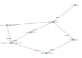
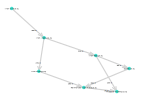
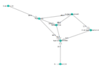

```julia
  >julia ]dev https://github.com/gsoleilhac/Satisfactory.jl
  >julia using Satisfactory

  >julia maximize!(ModularFrame ; resources = Dict(IronOre => 480))
    OPTIMAL
    23.162
    
    Products : 
    IronIngot : 480.0
    IronOre : 480.0
    IronPlate : 115.818
    IronRod : 138.981
    ModularFrame : 23.164
    ReinforcedIronPlate : 34.745
    Wire : 301.126
    
    Recipes : 
    Iron Plate
    	input : IronIngot : 173.7265/min 
    	IronPlate : 115.8177/min
    	5.791 Constructor
    Iron Rod
    	input : IronIngot : 138.9812/min 
    	IronRod : 138.9812/min
    	9.265 Constructor
    Iron Ore
    	IronOre : 480.0/min
    	8.0 Miner
    Iron Ingot
    	input : IronOre : 480.0/min 
    	IronIngot : 480.0/min
    	16.0 Smelter
    Modular Frame
    	input : ReinforcedIronPlate : 34.7453/min IronRod : 138.9812/min 
    	ModularFrame : 23.1635/min
    	11.582 Assembler
    Alternate: Stitched Iron Plate
    	input : IronPlate : 115.8177/min Wire : 301.126/min 
    	ReinforcedIronPlate : 34.7453/min
    	6.177 Assembler
    Alternate: Iron Wire
    	input : IronIngot : 167.2922/min 
    	Wire : 301.126/min
    	13.383 Constructor
```



```julia
  >julia unlocked = [
    "Alternate: Wet Concrete", "Alternate: Polymer Resin", "Alternate: Recycled Rubber", "Alternate: Recycled Plastic", "Alternate: Pure Copper Ingot", # Refinery
    "Alternate: Steel Rod", "Alternate: Steel Screw", "Alternate: Iron Wire", # Constructor
    "Alternate: Encased Industrial Pipe", "Alternate: Bolted Frame", "Alternate: Coated Iron Plate", "Alternate: Copper Rotor",  #Assembler
    "Alternate: Quickwire Stator", "Alternate: Steel Rotor", "Alternate: Silicone Circuit Board", "Alternate: Cheap Silica", "Alternate: Compacted Coal", #Assembler
    "Alternate: Automated Speed Wiring" #Manufacturer
    ]
  >julia lockedRecipes = setdiff(map(r -> r.name, filter(r -> occursin("Alternate:", r.name), allRecipes)), unlocked);
  >julia maximize!(ModularFrame ; resources  = Dict(IronOre => 480), lockedRecipes)

    OPTIMAL
    19.999
    
    Products : 
    IronIngot : 480.0
    IronOre : 480.0
    IronPlate : 180.0
    IronRod : 210.0
    ModularFrame : 20.0
    ReinforcedIronPlate : 30.0
    Screw : 360.0
    
    Recipes : 
    Reinforced Iron Plate
    	input : IronPlate : 180.0/min Screw : 360.0/min 
    	ReinforcedIronPlate : 30.0/min
    	6.0 Assembler
    Screw
    	input : IronRod : 90.0/min 
    	Screw : 360.0/min
    	9.0 Constructor
    Iron Plate
    	input : IronIngot : 270.0/min 
    	IronPlate : 180.0/min
    	9.0 Constructor
    Iron Rod
    	input : IronIngot : 210.0/min 
    	IronRod : 210.0/min
    	14.0 Constructor
    Iron Ore
    	IronOre : 480.0/min
    	8.0 Miner
    Iron Ingot
    	input : IronOre : 480.0/min 
    	IronIngot : 480.0/min
    	16.0 Smelter
    Modular Frame
    	input : ReinforcedIronPlate : 30.0/min IronRod : 120.0/min 
    	ModularFrame : 20.0/min
    	10.0 Assembler
```



```julia
>julia maximizeDiscrete!(Supercomputer, 1/3; # Only allows buildings to run at 33%, 66% or 100%
    resources = Dict(CrudeOil => 210, Quickwire => 5000, CircuitBoard => 50, 
    Cable => 250, Plastic => 500, Screw => 5000, CopperSheet => 1000), 
    lockedRecipes = [lockedRecipes ; "Alternate: Recycled Plastic"])

    OPTIMAL
    4.999
    
    Products : 
    AILimiter : 10.0
    Cable : 240.0
    CircuitBoard : 115.0
    Computer : 10.0
    CopperSheet : 180.0
    CrudeOil : 120.0
    HighSpeedConnector : 15.0
    Plastic : 580.0
    Quickwire : 1040.0
    Screw : 520.0
    Supercomputer : 5.0
    
    Recipes : 
    Crude Oil
    	CrudeOil : 120.0/min
    	2.0 OilExtractor
    Circuit Board
    	input : CopperSheet : 130.0/min Plastic : 260.0/min 
    	CircuitBoard : 65.0/min
    	8.667 Assembler
    Plastic
    	input : CrudeOil : 120.0/min 
    	Plastic : 80.0/min
    	HeavyOilResidue : 40.0/min
    	4.0 Refinery
    Computer
    	input : CircuitBoard : 100.0/min Cable : 90.0/min Plastic : 180.0/min Screw : 520.0/min 
    	Computer : 10.0/min
    	4.0 Manufacturer
    A.I. Limiter
    	input : CopperSheet : 50.0/min Quickwire : 200.0/min 
    	AILimiter : 10.0/min
    	2.0 Assembler
    High-Speed Connector
    	input : Quickwire : 840.0/min Cable : 150.0/min CircuitBoard : 15.0/min 
    	HighSpeedConnector : 15.0/min
    	4.0 Manufacturer
    Supercomputer
    	input : Computer : 10.0/min AILimiter : 10.0/min HighSpeedConnector : 15.0/min Plastic : 140.0/min 
    	Supercomputer : 5.0/min
    	2.667 Manufacturer
```


