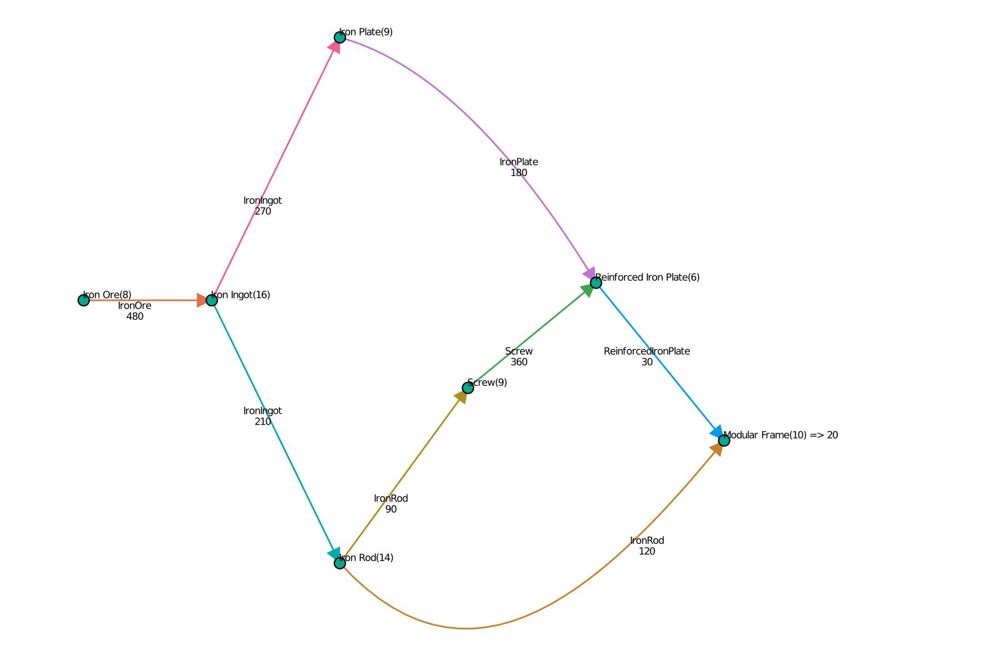
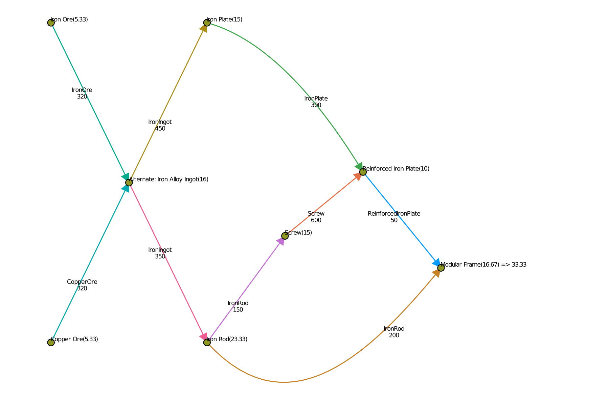

```julia
  >julia ]add https://github.com/gsoleilhac/Satisfactory.jl
  >julia using Satisfactory
```

```
maximize!(ModularFrame ; resources = Dict(IronOre => 480))
```
 

```
maximize!(ModularFrame ; resources = Dict(p => 320 for p in (IronOre, CopperOre)), alternates=["Ingot", "Wire"])
```


```julia
maximizeDiscrete!(Supercomputer, 1/3 ; # only allows building to run at 33, 66, or 100% efficiency`
    resources = Dict(p => 300 for p in baseResources), alternates=["Wire", "Ingot"])
```

